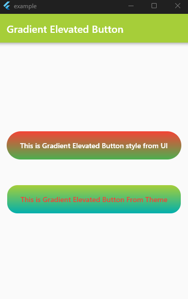

# GradientElevatedButton

[](https://pub.dartlang.org/packages/like_button) [](https://github.com/fluttercandies/like_button/blob/master/LICENSE) 

A GradientElevatedButton is a custom button widget that provides a visually appealing gradient background. It inherits from the ElevatedButton widget, which is a built-in button widget that displays a material-style raised button. The GradientElevatedButton extends the functionality of the ElevatedButton by adding the ability to specify a gradient background for the button.

[Demo](https://github.com/ChegzDev/gradient_elevated_button/blob/master/example/lib/main.dart)



## Installation

To use GradientElevatedButton, add it to your dependencies in `pubspec.yaml`:
```dart
dependencies :
  gradient_elevated_button : ^0.0.4
```

## Usage

Simply import the package and use the `GradientElevatedButton` widget in your Flutter app. Here is an example:

```dart    
GradientElevatedButton(
  onPressed: () {

  },
  style: GradientElevatedButton.styleFrom(
    gradient: const LinearGradient(colors: [
      Color.fromARGB(255, 166, 206, 57),
      Color.fromARGB(255, 0, 175, 173),
    ],
      begin: Alignment.topCenter,
      end: Alignment.bottomCenter,
    ),
  ),
  child: const Text("This is Gradient Elevated Button"),
),
```  

## Example

[click here](https://github.com/ChegzDev/gradient_elevated_button/blob/master/example/lib/main.dart) for example


## Issues and feedback

Please file issues and feedback using the Github issues page for this repository.

If you have any suggestions or feedback, please send an email to __chegz.dev@gmail.com__ and we'll be happy to hear from you!